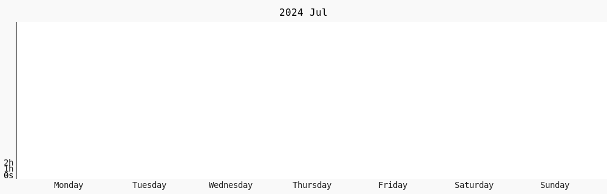

<!-- README.md -->

<h1 align="center">Ryan O'Boyle — LayerDynamics</h1>

  <b>Full‑stack & ML Developer · Rustacean · OSS Advocate</b> 
  🛠 Building performant, type‑safe software at the intersection of <b>Machine Learning</b>,
  <b>WebAssembly</b>, and <b>Developer Tooling</b>.

  
  
  
  
  

## 🚀 About Me

I'm a developer obsessed with shipping **real‑world, production‑grade** machine‑learning and web solutions.
My toolbox spans **Python**, **JavaScript/TypeScript**, and **Rust**, with deep experience in **PyTorch**, **FastAPI**, **React**, **Deno**, and **WebAssembly**.
When I'm not coding, I'm probably reverse‑engineering file formats, reading about compilers, or automating something that shouldn't be automated.

---

## 📌 Featured Projects

| Project                                                             | Description                                                                                                | Tech Highlights                                 |
| ------------------------------------------------------------------- | ---------------------------------------------------------------------------------------------------------- | ----------------------------------------------- |
| **[Rex‑ORM](https://github.com/LayerDynamics/rex-orm)**             | Modern TypeScript ORM for Deno with real‑time sync, GraphQL schema generation, and serverless‑first DX.    | Deno • TypeScript • PostgreSQL/SQLite • GraphQL |
| **[Node‑Rust‑PTY](https://github.com/LayerDynamics/node-rust-pty)** | High‑performance PTY bindings for Node.js with virtual DOM rendering and advanced session management.      | Rust • N‑API • xterm.js                         |
| **[Stega](https://github.com/LayerDynamics/stega)**                 | CLI framework for Deno featuring workflow automation, template generation, and service management.         | Deno • TypeScript • YAML                        |
| **[Scriptic](https://github.com/LayerDynamics/scriptic)**           | Minimalist embeddable Python REPL with zero dependencies.                                                  | C • Python/C‑API                                |
| **[MDX‑to‑JSON](https://github.com/LayerDynamics/mdx-to-json)**     | Transforms MDX documents into structured JSON for headless CMS and data pipelines.                         | Next.js • MDX • Vite                            |
| **[TGC](https://github.com/LayerDynamics/tgc)**                     | Graph‑aware, WASM‑powered TypeScript compiler with granular security policies and cross‑platform binaries. | Rust • Wasm • SWC                               |

---

## 🧠 Tech Stack & Interests

* **Machine Learning** – NLP & CV, model compression, ONNX, CUDA kernels
* **Web Development** – React, Vite, FastAPI, GraphQL, htmx
* **Rust & WebAssembly** – Systems programming, compiler plugins, WASI, sandboxed plugins
* **Dev Tooling** – CLIs, bundlers, test frameworks, fuzzers
* **Security** – Secure coding, penetration testing, side‑channel analysis
* **Open Source** – I maintain a handful of OSS projects and contribute where I can.

---

## 📈 Weekly Coding Activity

  

---

## 🤝 Connect with Me

* Twitter / X: [@Layer\_Dynamics](https://x.com/Layer_Dynamics)
* LinkedIn: [LayerDynamics](https://www.linkedin.com/in/layerdynamics)
* Email: [layerdynamics@proton.me](mailto:layerdynamics@proton.me)

---
 > *“Talk is cheap. Show me the code.”* — Linus Torvalds
