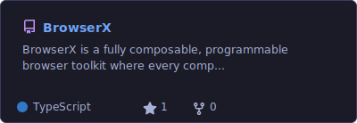
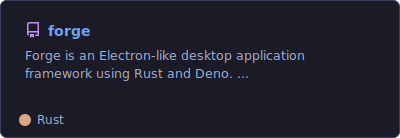
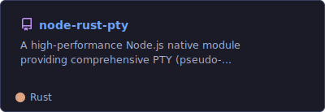
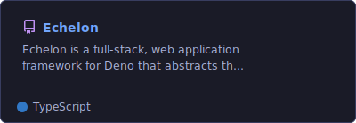
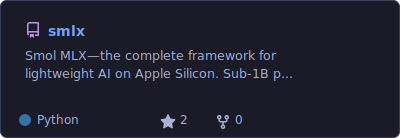
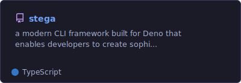
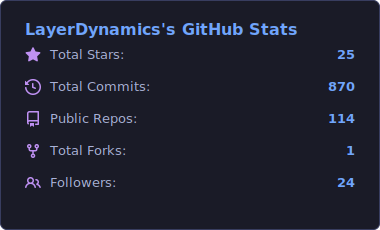
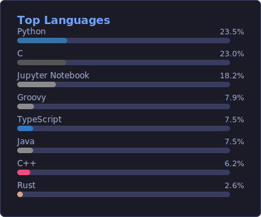
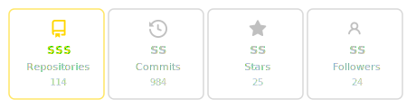
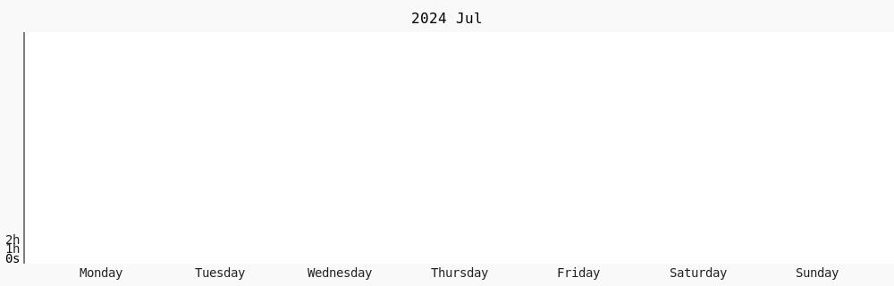

# Ryan O'Boyle

**Layer Dynamics**

---
I like building things from scratch — runtimes, frameworks, CLI tools, whatever. If I can't find something that works the way I need it to, I'll just make it. Most of my stuff is cross-language because different problems call for different tools.

## Featured Projects

## Areas of Focus

<strong>Systems Programming & Native Runtimes</strong> — Custom runtimes, FFI bridges, capability-based security

| Project | Lang | What it demonstrates |
|---------|------|---------------------|
| [forge](https://github.com/LayerDynamics/forge) | Rust + Deno | Electron alternative with capability-based security and system WebViews |
| [node-rust-pty](https://github.com/LayerDynamics/node-rust-pty) | Rust + Node.js | Native PTY with virtual DOM terminal rendering via N-API |
| [blkbox](https://github.com/LayerDynamics/blkbox) | Rust | Sandboxed execution environment |
| [aether](https://github.com/LayerDynamics/aether) | Rust | Low-level runtime experimentation |
| [bb-stream](https://github.com/LayerDynamics/bb-stream) | Go | Streaming infrastructure |

<strong>AI/ML on Apple Silicon</strong> — Local inference, MLX optimization, sub-1B model tooling

| Project | Lang | What it demonstrates |
|---------|------|---------------------|
| [smlx](https://github.com/LayerDynamics/smlx) | Python + MLX | Sub-1B parameter framework for M4. Quantization, OpenAI-compatible API, agent system |
| [MLXR](https://github.com/LayerDynamics/MLXR) | C++ | MLX runtime extensions |
| [mlxllm](https://github.com/LayerDynamics/mlxllm) | Python | vLLM implementation specifically for M-class chips |
| [destill3d](https://github.com/LayerDynamics/destill3d) | Python | ML distillation pipelines |

<strong>AI Agents & Autonomous Systems</strong> — Agent architectures, tool-use frameworks, MCP servers

| Project | Lang | What it demonstrates |
|---------|------|---------------------|
| [agent-x](https://github.com/LayerDynamics/agent-x) | Python | Full-featured agent with tool integration |
| [agent_io](https://github.com/LayerDynamics/agent_io) | Python | Browser, desktop, coding, and vision-capable agent |
| [agent-xsh](https://github.com/LayerDynamics/agent-xsh) | Python | Offline-first AI coding agent |
| [canto](https://github.com/LayerDynamics/canto) | TypeScript | MCP server for Claude Code plugin scaffolding |
| [universal_query_agent](https://github.com/LayerDynamics/universal_query_agent) | Python | QL-to-QL conversion agent |

<strong>3D Graphics & Computational Geometry</strong> — CAD toolchains, point clouds, WebGL/Three.js pipelines

| Project | Lang | What it demonstrates |
|---------|------|---------------------|
| [GameWarden](https://github.com/LayerDynamics/GameWarden) | Rust | ML-first game engine (Bevy ECS + Rapier3D + Gymnasium) |
| [fluxon](https://github.com/LayerDynamics/fluxon) | TypeScript | PBR/path-tracing tile-based renderer for Three.js/R3F |
| [deno-three](https://github.com/LayerDynamics/deno-three) | TypeScript | Dependency-free 3D library for Deno |
| [500kdensityPointClouds](https://github.com/LayerDynamics/500kdensityPointClouds) | — | High-density point cloud processing |
| [react-three-fiber](https://github.com/LayerDynamics/react-three-fiber) | TypeScript | React renderer for Three.js |

<strong>Developer Tooling & CLIs</strong> — CLI frameworks, dependency analysis, code generation

| Project | Lang | What it demonstrates |
|---------|------|---------------------|
| [stega](https://github.com/LayerDynamics/stega) | TypeScript/Deno | CLI framework: workflows, i18n, plugins, templates, service management |
| [llm-pack](https://github.com/LayerDynamics/llm-pack) | JavaScript | Package LLM contexts from codebases |
| [CodeMarauder](https://github.com/LayerDynamics/CodeMarauder) | TypeScript | Code generator and search engine for web/data queries |
| [nodepad](https://github.com/LayerDynamics/nodepad) | TypeScript | Node-based visual editor |
| [logly](https://github.com/LayerDynamics/logly) | Python | Structured logging utility |
| [RustSee](https://github.com/LayerDynamics/RustSee) | Rust | Interactive code visualizer for Rust/Tauri projects |
| [mdpx](https://github.com/LayerDynamics/mdpx) | TypeScript | Markdown editor and previewer |

<strong>Web Frameworks & Full-Stack</strong> — Zero-dep application frameworks, ORMs, composable toolkits

| Project | Lang | What it demonstrates |
|---------|------|---------------------|
| [BrowserX](https://github.com/LayerDynamics/BrowserX) | TypeScript/Deno + Rust | Composable browser toolkit: engine, proxy, query, GPU compute, CDP, MCP server |
| [Echelon](https://github.com/LayerDynamics/Echelon) | TypeScript/Deno | Zero-dep "Application OS" — RBAC, KV ORM, telemetry, WASM sandbox |
| [rex-orm](https://github.com/LayerDynamics/rex-orm) | TypeScript/Deno | ORM with real-time WebSocket sync + GraphQL generation |
| [tgc](https://github.com/LayerDynamics/tgc) | TypeScript + Rust/WASM | TypeGraph Compiler — graph-based dependency management |

<strong>WebAssembly</strong> — Rust→WASM compilation, browser/edge compute, cross-platform binaries

| Project | Lang | What it demonstrates |
|---------|------|---------------------|
| [forge](https://github.com/LayerDynamics/forge) | Rust → WASM | WASM-enabled desktop runtime |
| [tgc](https://github.com/LayerDynamics/tgc) | Rust → WASM | WASM-powered TypeScript compiler |
| [Echelon](https://github.com/LayerDynamics/Echelon) | TypeScript/Deno | WASM execution sandbox within application framework |

## Philosophy

Build the thing. Don't configure someone else's thing. Zero-dep where possible. Cross-language when the problem demands it. Systems-level thinking at every layer.

## GitHub Stats

## Dedicated

---

